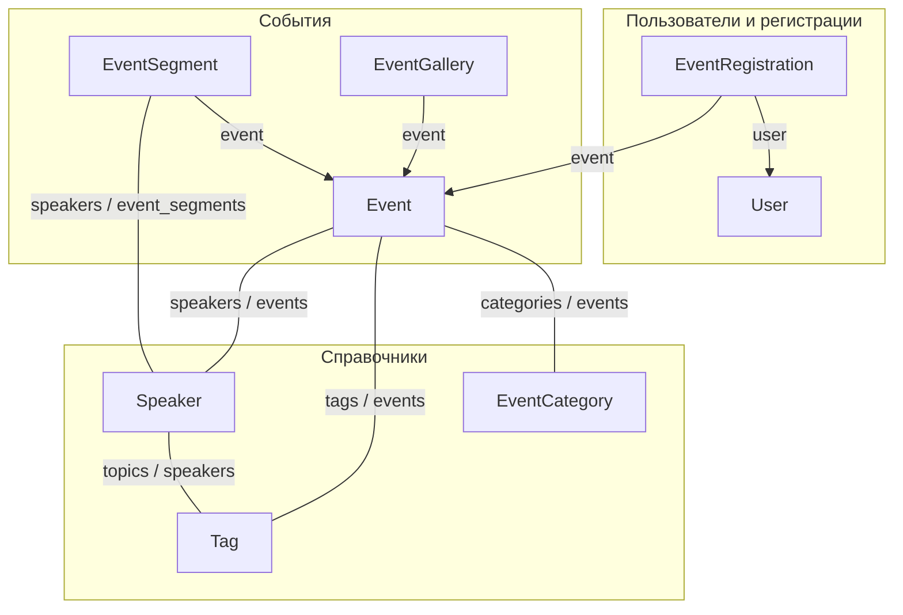
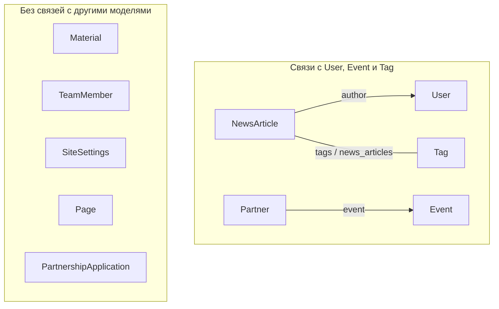

# Диаграмма связей моделей PM.Meetup

Наглядная схема связей между моделями (ForeignKey и ManyToMany). Подписи на линиях — имена полей и related_name.

---

## 1. Ядро: пользователи, события, регистрации, галереи

- **Стрелка (→):** ForeignKey. Направление от модели, у которой объявлено поле, к модели, на которую ссылаются. Подпись — имя поля (например, `event`, `user`).
- **Двойная линия (—):** ManyToMany. Подпись в формате `поле / related_name` (например, у Event поле `categories`, у EventCategory обратный доступ `events`).

---

## 2. Контент: новости, партнёры, страницы

Модели Material, TeamMember, SiteSettings, Page, PartnershipApplication не имеют ForeignKey или M2M к другим приложениям и показаны отдельным блоком. Tag участвует в первой диаграмме; связь NewsArticle — Tag здесь показана для полноты (можно считать её частью «Новости»).

---

## Легенда

| Обозначение | Значение | Пример в коде |
|-------------|----------|----------------|
| **Стрелка → с подписью** | ForeignKey: у модели-источника есть поле с таким именем | `EventSegment.event` — поле в коде; у события обратно: `event.segments` (related_name) |
| **Линия — с подписью "A / B"** | ManyToMany: с одной стороны поле A, с другой related_name B | У Event поле `categories`, у EventCategory — `category.events` |

**Как читать подписи:**
- **Поле** — объявлено в классе модели (например, `event = models.ForeignKey(Event, ...)`). Обращение: `объект_сегмента.event` → получишь событие.
- **related_name** — обратная связь на другой модели; в коде поле не объявляется, его даёт Django. Обращение: `объект_события.segments` → получишь все сегменты этого события.

**Примеры из проекта:**
- `segment.event` — поле (одно событие у сегмента).
- `event.segments` — related_name (много сегментов у события).
- `event.speakers` и `speaker.events` — M2M: поле на Event, related_name на Speaker.
